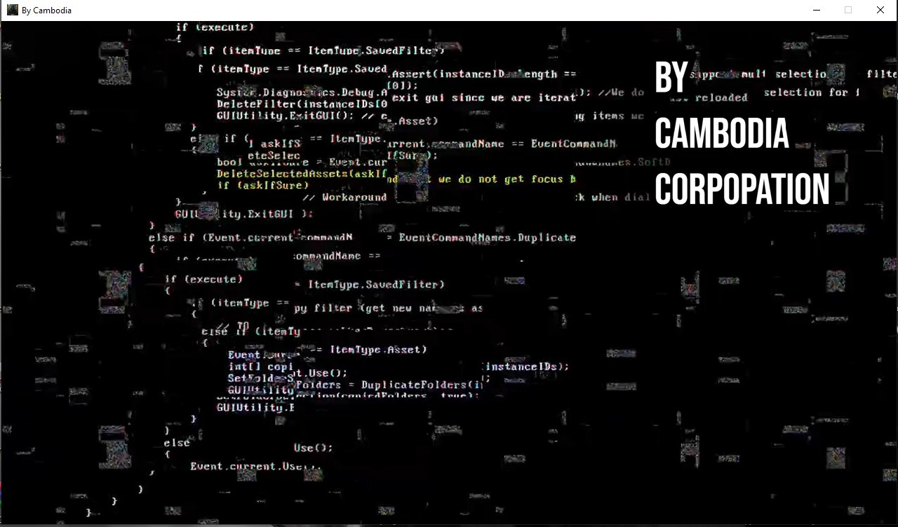
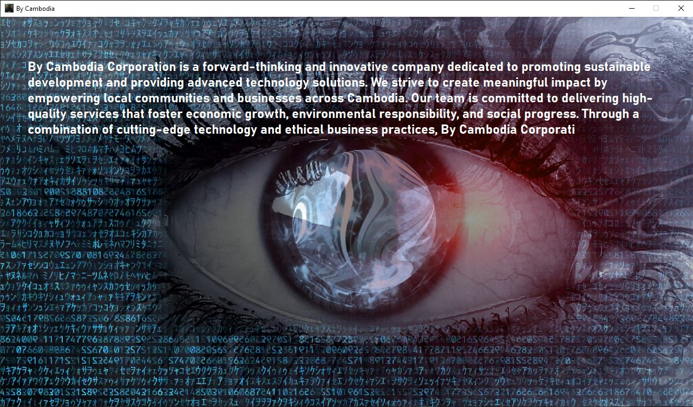
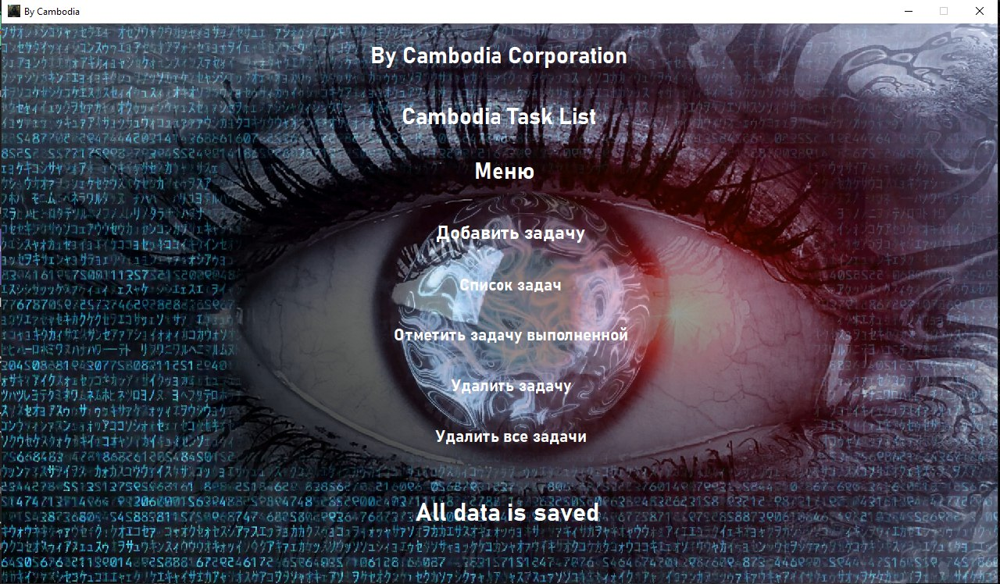
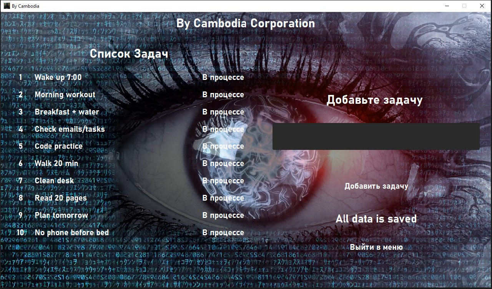
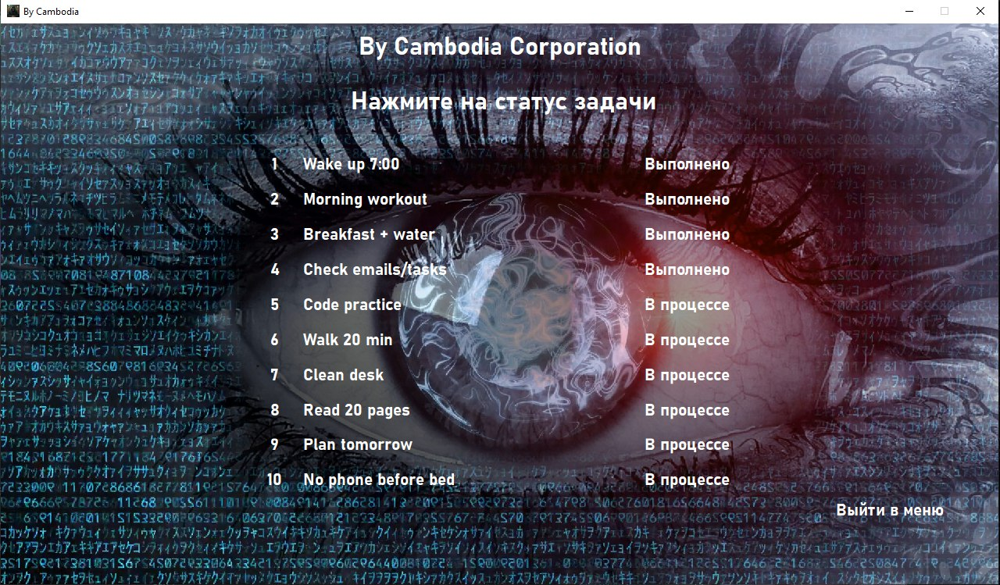
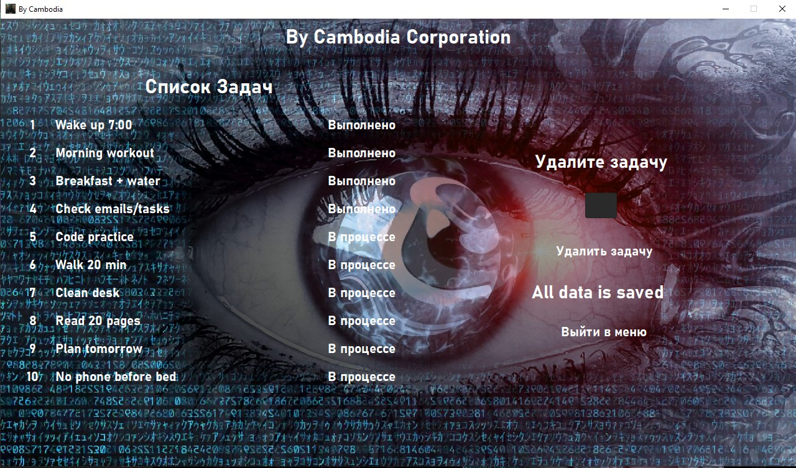

# Task List Desktop Application

[🇷🇺 Читать на русском](README.ru.md)

A simple task manager built with **C++ and Qt**.  
Features include adding, marking, and deleting tasks with a custom UI.

---

● Custom UI design with intro video and background music 

## ✨ Features

● Add new tasks

● Mark tasks as *in progress* or *completed* 

● Delete one or all tasks 

 
 
 
 
 
 
 

